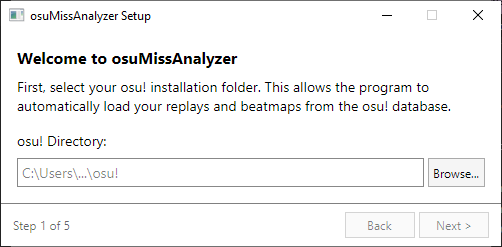

# osu! Miss Analyzer

A program to analyze misses in an osu! replay + better desktop support

## How To Use

On first launch, a setup wizard will guide you through configuring your osu! directory, songs folder, API key, theme, and watch mode, all from the UI!

You can also manually edit `options.cfg` if you prefer.

To run the program, double-click the icon or drag a replay file onto the exe. If you didn't specify a replay file manually, you can select from the five most recent replays found in your osu! directory (saved or otherwise). After this, it'll search your osu!db to find the corresponding beatmap, or open a file chooser dialog if it couldn't find osu!.db.

After it's found the beatmap and replay, it'll analyze the misses and display them in an interactive window.

### Controls

| Key | Action|
|-|-|
|Up Arrow/Scroll Up|Zoom in|
|Down Arrow/Scroll Down|Zoom out|
| Right Arrow/Left Mouse | Next miss |
| Left Arrow/Right Mouse | Previous miss |
| T | Draw outlines only |
| P | Save images for each miss |
| R | Select new replay |
| A | Switch between viewing only misses and viewing all objects |

### Options

All options can be configured through the setup wizard (shown on first launch) or manually in `options.cfg`.

To add these to options.cfg, add a new line formatted `<Setting Name>=<Value>`

| Setting | Description |
|-|-|
|OsuDir|Specify the osu! directory. Make sure that osu!.db is in here. If the program takes a while to start, please add this option.|
|SongsDir|Specify osu!'s songs dir. Only necessary if it isn't OsuDir/Songs.|
|APIKey|osu! API key|
|WatchDogMode|Enable watch dog mode, in which newest replays in OsuDir are loaded as they appear.|
|ColorScheme|Changes the program's color scheme. Accepted values are Default or Dark|

## Alternate Usage

You can also run it from the command line with this format: `osuMissAnalyzer.exe [<replay> [<beatmap>]]`

## Credits

- Beatmap and replay parsing/analysis by [firedigger](https://github.com/firedigger) ([osuReplayAnalyzer](https://github.com/firedigger/osuReplayAnalyzer))
- Forked from [ThereGoesMySanity's osuMissAnalyzer](https://github.com/ThereGoesMySanity/osuMissAnalyzer), consider [sponsoring](https://github.com/sponsors/ThereGoesMySanity) the original author!
- Icon by [j8chi - Flaticon](https://www.flaticon.com/free-icons/pixel)
